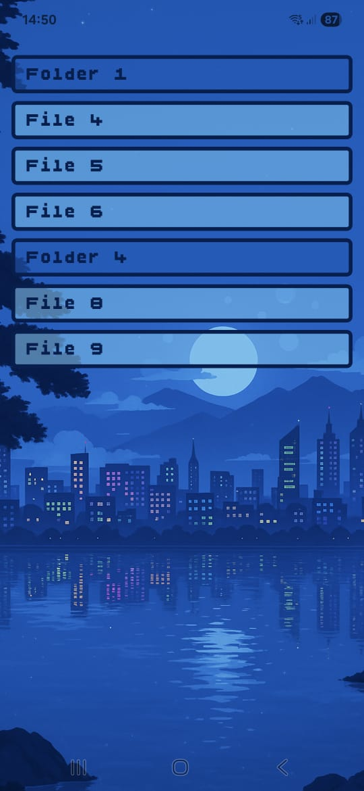

# React-Native-app

# Features

## Tasks Page

- See tasks
- add/delete task

## Task Creation Page

- Title
- Notes.
- CreationDate
- UpdateDate
- Tags (dropdown). User can create a new tag from this page
- Recurring (check box)
- Recurring Tasks – Repeat daily, weekly, monthly, etc.
- Deadline
- Reminders (Get alerts before or when tasks are due via push notification)
- Status Tracking – Label tasks as "To Do", "In Progress", or "Done".
- Estimation - how much time it takes to finish this task

## Search Page
- Search, filter and orderby tasks
- Easily find tasks by Tile, note, tag, Recurring, creation, update, deadline dates (before/after/between), status and etc.
- Save search as query

## Queries Page
- See list of all queries, click it to go to Search Page
- Set a query as a home page

## Home Page
- It is a Search Page. It use the query defined for home page. 

## References:

## Attributions 

Background image: https://wallpapers.com/background/aesthetic-pixel-background-ect4jlo8tagx65ea.html